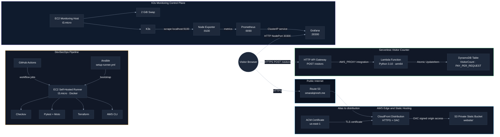

# Cloud Resume Challenge

Serverless resume platform, DevSecOps pipeline, and observability lab built as a practical cloud architecture portfolio piece.

This repository shows how a static frontend, a Lambda-based visitor counter, and a lightweight Kubernetes monitoring stack can be stitched together into a single, production-shaped system. The goal is not just to ship a working Cloud Resume Challenge implementation, but to demonstrate the thinking of a DevOps engineer who is deliberately moving toward solutions architecture: strong separation of concerns, low operational overhead, security-first edge design, and an IaC-first delivery model.

> [!NOTE]
> The stack is intentionally lightweight and cost-conscious, but the repo should be read as a real architecture exercise rather than a literal $0/month promise. Actual spend depends on traffic, DNS, AWS account settings, and how long the EC2 runner and observability host remain online.

## What This Project Demonstrates

- A static resume frontend delivered through S3 and CloudFront with Origin Access Control, so the bucket itself stays private.
- A serverless visitor counter built on API Gateway, Python 3.10 Lambda, and DynamoDB On-Demand using atomic `UpdateItem` writes.
- A self-hosted GitHub Actions runner on EC2, bootstrapped with Ansible and used to execute the deployment pipeline.
- A K3s-based monitoring control plane running Prometheus and Grafana on a small EC2 instance with swap-enabled memory headroom.
- A repository structure that separates application code, infrastructure, automation, and monitoring concerns cleanly enough to scale into a multi-environment platform.

## Architecture Diagram



## Architecture Notes

### Edge and delivery

The frontend is a static site hosted in S3 and served through CloudFront. The bucket has public access blocked, and CloudFront is the only sanctioned origin path through OAC. The apex record in Route 53 aliases the distribution, and the ACM certificate is created in `us-east-1`, which is required for CloudFront certificates.

### Serverless visitor counter

The counter endpoint is an HTTP API Gateway route that accepts `POST /visitors` and forwards requests to a Python 3.10 Lambda function running on `arm64`. The function increments the `VisitorCount` DynamoDB table using a single atomic `UpdateItem` operation with `ADD`, which avoids read-modify-write races and keeps the implementation simple.

### DevSecOps pipeline

The deployment workflow runs on a self-hosted EC2 runner. Ansible installs the runner prerequisites, Docker, and a 2 GiB swap file to make the small instance more stable under containerized workloads. The GitHub Actions workflow then runs three phases: Checkov scanning, pytest-based backend validation, and infrastructure/application deployment through containerized Terraform and AWS CLI steps.

### Observability plane

The monitoring stack runs locally on a separate EC2 host with K3s. Prometheus is configured with a 15-second scrape interval, a seven-day retention window, and host-network access to scrape Node Exporter on port `9100`. Grafana is exposed via NodePort `30300` for fast access during lab-style validation.

## Project Structure

| Path | Purpose |
| --- | --- |
| `.github/workflows/deploy.yml` | Self-hosted DevSecOps pipeline with security scan, test, Terraform apply, S3 sync, and CloudFront invalidation. |
| `ansible/inventory.ini` | SSH inventory for the runner host. |
| `ansible/setup-runner.yml` | Runner bootstrap playbook; installs packages, Docker, swap, and the runner workspace. |
| `backend/lambda_function.py` | Visitor counter Lambda handler with atomic DynamoDB updates and CORS headers. |
| `backend/lambda_test.py` | Moto-backed pytest suite covering happy path, upsert behavior, and failure propagation. |
| `infrastructure/acm.tf` | ACM certificate for the CloudFront alias domain. |
| `infrastructure/api_gateway.tf` | HTTP API for the visitor counter route and Lambda integration. |
| `infrastructure/cloudfront.tf` | CloudFront distribution, OAC, and S3 bucket policy. |
| `infrastructure/database.tf` | DynamoDB visitor counter table and seed item. |
| `infrastructure/lambda.tf` | Lambda package, IAM role, policy, and function definition. |
| `infrastructure/provider.tf` | AWS provider, region config, and S3 backend. |
| `infrastructure/route53.tf` | Hosted zone and apex alias record. |
| `infrastructure/runner.tf` | EC2 self-hosted runner, key pair, security group, and outputs. |
| `infrastructure/s3.tf` | Private static website bucket and public access block. |
| `k8s/00-namespace.yaml` | Monitoring namespace. |
| `k8s/01-prometheus.yaml` | Prometheus deployment, service, and configuration. |
| `k8s/02-grafana.yaml` | Grafana deployment and NodePort service. |
| `website/index.html` | Semantic resume frontend. |
| `website/script.js` | Visitor counter client logic. |
| `website/styles.css` | Dark, responsive visual treatment for the portfolio page. |
| `website/assets/pfp.png` | Profile image used by the resume page. |
| `website/assets/grafana dashboard.png` | Static Grafana dashboard snapshot used in the README. |
| `.gitignore` | Excludes Terraform state, keys, Python caches, and local IDE artifacts. |

## Services Used

| Layer | Services |
| --- | --- |
| Edge and delivery | Amazon Route 53, Amazon CloudFront, AWS Certificate Manager, Amazon S3 |
| Serverless backend | Amazon API Gateway HTTP API, AWS Lambda, Amazon DynamoDB |
| DevSecOps | GitHub Actions, Ansible, Terraform, AWS CLI, Checkov, Pytest, Moto, Docker |
| Monitoring | Amazon EC2, K3s, Prometheus, Grafana, Node Exporter |

## Tech Stack

| Category | Stack |
| --- | --- |
| Frontend | HTML5, CSS3, vanilla JavaScript |
| Backend runtime | Python 3.10 on AWS Lambda |
| Infrastructure as Code | Terraform |
| Configuration management | Ansible |
| Containers and orchestration | Docker, K3s |
| Testing | Pytest, Moto |
| Security and linting | Checkov |
| Cloud region usage | `eu-central-1` for primary infrastructure, `us-east-1` for ACM |

## How It Fits Together

1. A visitor opens `omaralqinneh.me`.
2. Route 53 resolves the domain to the CloudFront distribution.
3. CloudFront serves the static resume from the private S3 bucket.
4. The browser sends a `POST` request to the API Gateway visitor counter endpoint.
5. API Gateway invokes Lambda, which atomically increments DynamoDB and returns the new count.
6. The GitHub Actions workflow runs from the self-hosted runner and promotes changes with infrastructure, test, and sync steps.
7. The monitoring host runs K3s, Prometheus, and Grafana so the infrastructure itself remains observable.

## Build and Deployment Flow

### 1. Provision the AWS foundation

```bash
cd infrastructure/
terraform init
terraform apply
```

Terraform provisions the static hosting bucket, CloudFront distribution, DNS records, ACM certificate, DynamoDB table, Lambda function, API Gateway, and the EC2 runner resources.

### 2. Bootstrap the self-hosted runner

```bash
cd ansible/
ansible-playbook -i inventory.ini setup-runner.yml
```

The playbook configures the runner host, installs Docker, creates the swap file, and prepares the machine for GitHub Actions workloads.

### 3. Deploy the observability stack

```bash
ssh -i ~/.ssh/runner-key ubuntu@<EC2_PUBLIC_IP>
cd ~/k8s/
sudo k3s kubectl apply -f ./
```

Prometheus and Grafana are applied into the `monitoring` namespace and become reachable through the configured service endpoints.

### 4. Publish the frontend

The GitHub Actions workflow pushes the website to S3 and then invalidates the CloudFront cache so the latest static assets are served immediately.

## Quality Gates

- `backend/lambda_test.py` uses Moto and pytest to verify the Lambda logic without requiring live AWS resources.
- The workflow runs Checkov against the Terraform directory to surface infrastructure misconfigurations early.
- `terraform` is pinned through the lock file in `infrastructure/` so provider behavior stays reproducible.
- The Lambda code uses a single atomic write path instead of separate read and write calls, which is the right tradeoff for a visitor counter.

## Compliance, Privacy, and Data Sovereignty

This repository is not formally certified against any standard. Instead, it is intentionally built to align with the control themes below so the implementation reads like an architecture that can be defended in a security review.

| Framework / Body | Rules reflected in this repo | Where it shows up |
| --- | --- | --- |
| ISO/IEC 27001 and ISO/IEC 27017 | Least privilege, asset separation, cloud shared responsibility, change control, and private-by-default services | IAM policy scoped to `dynamodb:UpdateItem` and CloudWatch logs only; public access blocking on S3; Terraform-managed infrastructure; versioned storage |
| Jordan MoDEE PDPL No. 24 of 2023 | Data minimization, purpose limitation, privacy by design, and avoiding unnecessary personal data collection | The app stores only an aggregate visitor counter, not user identities; the frontend only sends a counter increment request; CORS is restricted to the production origin |
| Saudi SDAIA PDPL | Minimize personal data, limit processing to the declared purpose, and protect data from unnecessary exposure | No direct PII is collected; traffic is forced through HTTPS; the static origin is private behind CloudFront OAC |
| AWS Well-Architected Framework | Security, reliability, operational excellence, cost optimization, and sustainability | CloudFront OAC, ACM TLS, on-demand DynamoDB, `arm64` Lambda, automated CI/CD, and an observability layer on K3s |
| CNCF / Kubernetes best practices | Declarative infrastructure, namespace isolation, and composable workloads | `monitoring` namespace, ClusterIP for Prometheus, NodePort only for Grafana, and lightweight K3s deployment on a small node |

From a data-sovereignty perspective, this project is designed to keep the data surface area as small as possible: it collects no user profiles, no logins, no payment data, and no long-lived personal identifiers. The only persistent application data is the aggregate resume visit counter.

## Grafana Dashboard Snapshot

The dashboard below is a static snapshot from the K3s monitoring host. It is safer to publish than the live endpoint and still shows the operational character of the monitoring plane.


## Author

Built by Omar Alqinneh as a Cloud Resume Challenge project focused on practical DevOps delivery, AWS infrastructure, and the progression toward solutions architecture.
